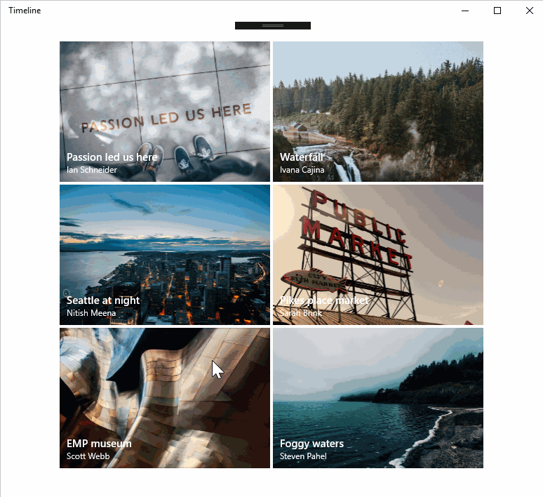
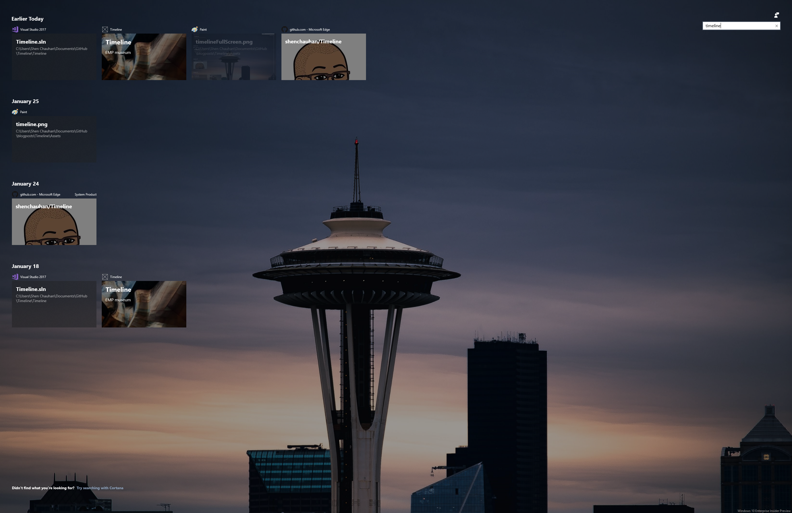
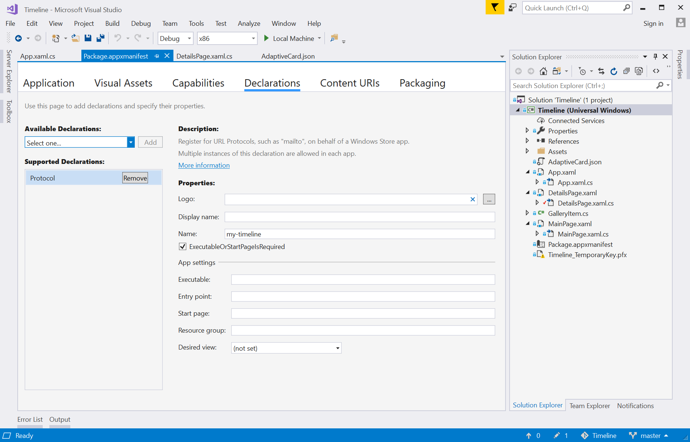

# Timeline

Before I get started, here is the source code that is mentioned in this blog:
[http://www.github.com/shenchauhan/Timeline](http://www.github.com/shenchauhan/Timeline, "Source")

## What is Timeline?

The time I spend in front of a screen spreads across various devices: my dev box, Surface Book, phone and Surface Studio. I love using these devices, what I don't love is when I have to try and pick up from where I was last week. What files did I have open? Where was I in those files? Which device did I last use them on? All this just adds to the Monday morning blues. I know most of you will say _"check your recent files!"_ but I'm one of those people that opens a lot of files across various apps and devices in day.

What I want is the ability to see my activity across my devices in a single place that's easy to digest, like a browser history for my application activity. I would  love to search a keyword that ties this experience together and be able to continue my activity in the right app, at the right place.

Well, guess what? Timeline is this experience! To try it out you'll need a build of  Windows greater than 17074 (currently an Insider build at time of writing).

I should also mention that because I log into Windows with my Microsoft Account (Hotmail/Outlook/Office 365) I get a enhanced experience because certain aspects like OneDrive and Office leverage the Microsoft Graph to enrich my Timeline so I can use any of my devices to continue my experience.

All I have to do is press Windows + Tab key or click this button in the task bar:


and this will appear:


What you see here is my Timeline feed where I have searched for the term "Timeline". It filters my history across my devices in my Microsoft Graph to show the files that I've touched in chronological order. As you can see, there is a Visual Studio Solution, a web site, an image and an application.

Simply clicking on any of these Adaptive Cards (remember this name for later) I will launch the application and in some cases deep link into the place where the activity was made. Yay!

## Why is Timeline important to a developer?

As a developer I have the responsibility of making the best user experience possible - I know you feel the same. A great user experience is when the the user is kept in their flow, driving them to be productive and enabling them to reach their goal.

Timeline is a great way Windows drives this productive user experience. As a developer you can enrich this experience by having your application participate in Timeline in a meaningful way. It can also lead to a greater user engagement because users now have another way to directly launch your app.

## The code

Timeline utilizes the [Microsoft Graph](https://developer.microsoft.com/en-us/graph/). The Microsoft Graph connects a combination of devices and files for a given user based on their associated Microsoft account (Outlook/Hotmail/Office 365). In our code we want to enrich the graph by marking important milestones the user may want to revisit. We do this by adding activity points in our application that writes to the Users Activity Channel. The User Activity Channel, as the name suggests, stores the history of the user activity.

Let's first look at the application.


It's a pretty simple application that shows images.

Before I show you adding items to the Timeline, let's take another look at my current Timeline.


As you can see the Timeline application was last used on the 18th January. It also has a subtitle of Pikes Place market (a famous market in Seattle, a must visit - also home to the first Starbucks, [well sort of](https://en.wikipedia.org/wiki/Original_Starbucks)) and a background image of the Public Market sign.

In my application I'm going to select the EMP Museum (another famous landmark of Seattle) and now click a button which will execute the code to add it to the Timeline. In most cases you will do this for the user, but I'm clicking a button for demonstration purposes.



Now when I visit my Timeline, you'll see the EMP museum image and the timestamp is today.



Cool eh?

Let's take a look at how I did this.

In my DetailsPage.xaml.cs I start by creating the variables I'll need to get started.

```csharp
private UserActivityChannel _userActivityChannel;
private UserActivity _userActivity;
private UserActivitySession _userActivitySession;
```

In the OnNavigatedTo override I assign these variables by:

* Getting the default User Activity Channel
* Getting or creating a User Activity called "LikePhoto".

```csharp
protected async override void OnNavigatedTo(NavigationEventArgs e)
{
    _userActivityChannel = UserActivityChannel.GetDefault();
    _userActivity = await _userActivityChannel.GetOrCreateUserActivityAsync("LikePhoto");
}
```

Next I'll need create an Adaptive Card. Let's start by defining what an Adaptive Card is. An Adaptive Card is JSON schema that allows you to create custom looking cards across Windows, iOS and Android for bots (Bot Framework etc.), messaging platforms (Facebook, Kik, Viber etc.) and in this case Timeline. I love the fact that I can really customize them - ok, I know in this case I was pretty boring and didn't get too adventurous, but check it out at:
[Adaptive Cards]("http://www.adaptivecards.io")

The Adaptive card payload in my app looks like this:

```json
{
  "$schema": "http://adaptivecards.io/schemas/adaptive-card.json",
  "type": "AdaptiveCard",
  "version":  "1.0",
  "backgroundImage": "{backgroundImage}",
  "body": [
    {
      "type": "Container",
      "items": [
        {
          "type": "TextBlock",
          "text": "Timeline",
          "weight": "bolder",
          "size": "extraLarge",
          "wrap": true,
          "maxLines": 3
        },
        {
          "type": "TextBlock",
          "text": "{name}",
          "size": "medium",
          "wrap": true,
          "maxLines": 3
        }
      ]
    }
  ]
}
```

Note for the background image and name, I've put placeholders in using {backgroundImage} and {name}. I'll replace these with real content depending on what the user clicks on.

When I'm ready to create a milestone in my Timeline i.e. when the user clicks the button in my app, here is the code that gets executed.

```csharp
private async void SymbolIcon_PointerPressed(object sender, PointerRoutedEventArgs e)
{
    // Fetch the adaptive card JSON
    var adaptiveCard = File.ReadAllText($@"{Package.Current.InstalledLocation.Path}\AdaptiveCard.json");

    // Replace the content.
    adaptiveCard = adaptiveCard.Replace("{backgroundImage}", _galleryItem.PublicUrl);
    adaptiveCard = adaptiveCard.Replace("{name}", _galleryItem.Name);

    // Create the protocol, so when the clicks the Adaptive Card on the Timeline, it will directly launch to the correct image.
    _userActivity.ActivationUri = new Uri($"my-timeline://details?{_galleryItem.ImageSource.Replace("ms-appx:///Assets/Images/", "")}");

    // Set the display text to the User Activity(e.g. Pike Place market.)
    _userActivity.VisualElements.DisplayText = _galleryItem.Name;

    // Assign the Adaptive Card to the user activity. 
    _userActivity.VisualElements.Content = AdaptiveCardBuilder.CreateAdaptiveCardFromJson(adaptiveCard);

    // Save the details user activity.
    await _userActivity.SaveAsync();

    // Dispose of the session and create a new one ready for the next user activity.
    _userActivitySession?.Dispose();
    _userActivitySession = _userActivity.CreateSession();

    await new MessageDialog("Added to timeline").ShowAsync();
}
```

When the user clicks the Adaptive Card in the Timeline, we need to make sure it has a way to activate our application. To do this I simply setup protocol activation. In the package.appxmanifest, I add a protocol.



In my App.xaml.cs, I override the OnActivated event so it can deep link the image.

```csharp
protected override void OnActivated(IActivatedEventArgs args)
{
    if (args.Kind == ActivationKind.Protocol)
    {
        if (args is ProtocolActivatedEventArgs protocolEventArgs)
        {
            var root = new Frame();
            Window.Current.Content = root;

            switch (protocolEventArgs.Uri.Host)
            {
                case "details":
                    root.Navigate(typeof(DetailsPage), s_galleryItems.FirstOrDefault(i => i.ImageSource == $"ms-appx:///Assets/Images/{protocolEventArgs.Uri.Query.Substring(1)}"));
                    break;
                default:
                    root.Navigate(typeof(MainPage));
                    break;
            }

            Window.Current.Activate();
        }
    }
}
```

Now when click the Adaptive Card it'll go straight to the details page:

And there you have it! We have successfully:

* Added to the users activity feed
* Created a custom Adaptive Card so it looks pretty
* Provided a way for users to deep link into you application

In this blog post I show you how to use the Windows UWP API, but remember this is all driven from the [Microsoft Graph](https://developer.microsoft.com/en-us/graph/) which is a REST based protocol. This means you can even add user activities from your web site.

I hope you found this useful. Here is the link to the code:
[http://www.github.com/shenchauhan/Timeline](http://www.github.com/shenchauhan/Timeline, "Source")

Happy Coding!